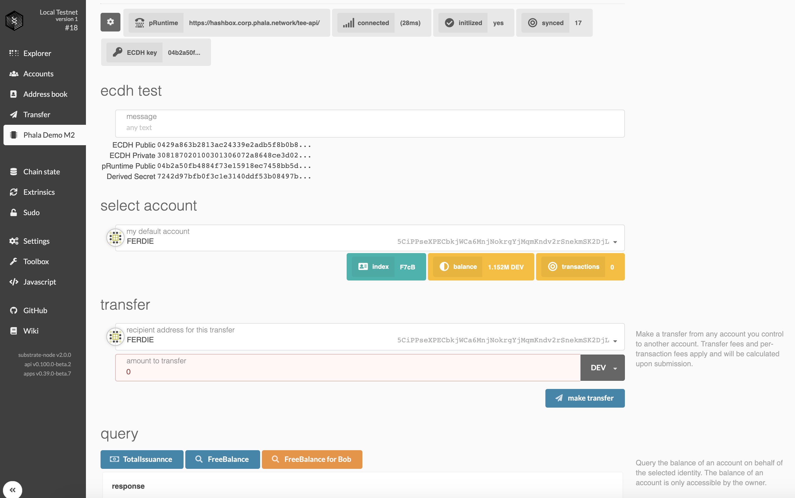
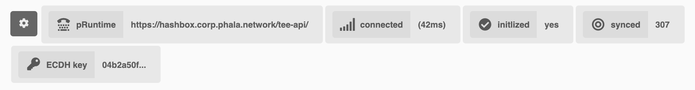
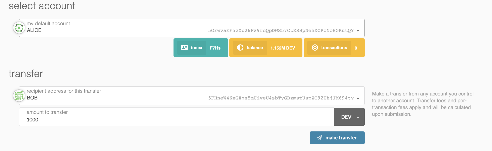
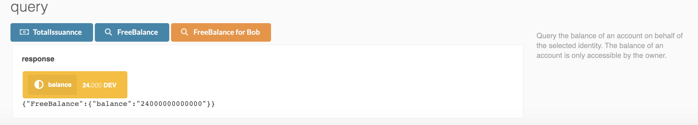
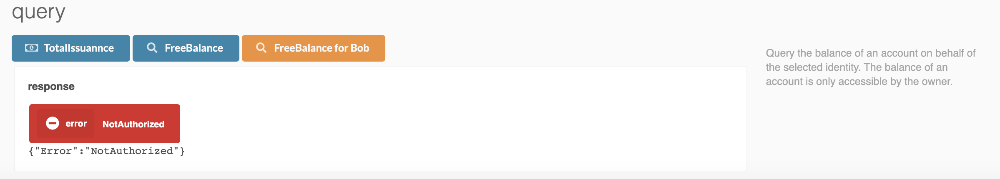
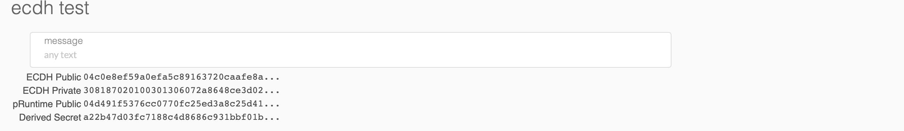

# M2: Confidential Balances Contract



This is the final deliverables of pLIBRA Milestone 2. It implements a confidential `Balances`-like
token contract where the balances are hidden to everyone except the owner.

The Balances module is a confidential contract on Phala Network. The contract execution happens
inside TEE (Trusted Execution Environment, a hardware enclave) to keep the internal state secret.

Only the authorized commands and queries are executed. So the unauthorized balance queries are
rejected.

## Build the demo

The frontend is deployed here: <https://webui.phala.network/>

To play with Phala Network, you also need to deploy the rest of the components. We made a Docker
image for easy deployment:

1. Clone [plibra-grant-docker](https://github.com/Phala-Network/plibra-grant-docker)

    ```bash
    git clone https://github.com/Phala-Network/plibra-grant-docker
    ```

2. Build

    ```bash
    cd plibra-grant-docker
    sudo docker build -t phala:test .
    ```

3. Run and publish the API port to 8080.

    ```bash
    sudo docker run -p 8080:8080 phala:test  
    ```

Enter the Substrate websocket RPC endpoint in `Settings` tab. If you published the port to 8080,
use `http://localhost:8080/ws`.



Enter `Phala Demo M2` tab. If you are using the default port 8080, the status bar should look like
the screenshot above. By default the pRuntime endpoint is `http://localhost:8080/tee-api/`. It can
be changed by clicking the setting button (first from left).

Once the pRuntime is connected, it shows "connected: (latency)". It should also say "initialized: yes", indicating a bridge between between the chain the pRuntime has already been established.

## Transfer



To transfer some token, please select an identity as the sender first. In the screenshot we are
transferring 1000 tokens from Alice to Bob.

At beginning, Alice is the only person with token. So we should transfer some tokens from Alice to
another person. Otherwise the transaction is not going to be executed because of insufficient funds.

## Check balance



After transferring 1000 tokens from Alice to Bob, we can check Alice's remaining balance by
`FreeBalance` query. So 24 tokens remain.

The query is performed by the selected identity (Alice in the screenshot). So if you query Bob's
balance, it should show 1000 as well.



However, as by the design, only the owner can see his balance. `FreeBalance for Bob` button
always queries Bob's balance. So if you choose another identity other than Bob, you will get a
`NotAuthorized` error as shown in the screenshot above. This is the unique feature provided of
confidential contracts.

Finally, `TotalIssuance` shows the total token issuance. It doesn't require any authentication.

## Ecdh Test



All the communication between the client and the confidential contract is end-to-end encrypted. The
encryption is based on ECDH key agreement. In this section it shows the agreed secret. (It's only
shown in the demo for testing purpose. It will be removed in production.)

## See also

Demo:

- M2: Confidential Balances Contract

Deep dive:

- [Basic concept](./basic-concept.md)
- [Life of a bridge](./life-of-a-bridge.md)
- [Life of a Command](./life-of-a-command.md)
- [Life of a Query](./life-of-a-query.md)

Projects:

- [phala-blockchain](https://github.com/Phala-Network/phala-blockchain): The blockchain and bridge
- [phala-pruntime](https://github.com/Phala-Network/phala-pruntime): pRuntime, the TEE worker
- [phala-polka-apps](https://github.com/Phala-Network/phala-polka-apps): The Web UI and SDK
- [plibra-grant-docker](https://github.com/Phala-Network/plibra-grant-docker): Docker build for M2
- [Technical Whitepaper](https://github.com/Phala-Network/Whitepaper)
