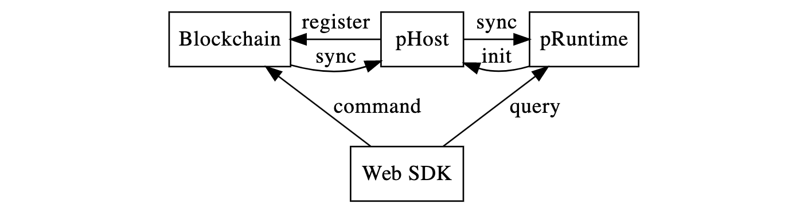

# Basic Concept

Phala Network is a confidential smart contract network implementing TEE-Blockchain Hybrid Architecture.

In Phala Network, **pRuntime** is the core unit of the network. Smart contracts are hosted by
pRuntime inside TEE Enclaves. It ensures confidentiality by running confidential smart contracts in the TEE Enclaves in CPUs.

## Remote Attestation

In order to make sure pRuntime is indeed secure (therefore not fake or compromised), the pRuntimes
are registered on the blockchain after passing Remote Attestation. It guarantees the pRuntime is:

- running inside a secure TEE enclave;
- the enclave doesn't have any known secure problem;
- the code of pRuntime matches the one published on the blockchain;
- an identity is generated by pRuntime securely.

## Establish trust

pRuntime runs off-chain. So it's necessary to establish the trust between the chain and the
runtime.

### pRuntime to the blockchain

When registering a pRuntime, the blockchain validates the Remote Attestation report offered by
the pRuntime. The upcoming messages from the pRuntime are signed by the committed identity. So the
blockchain can trust pRuntime until the registration expires.

The Remote Attestation report is a x509 certificate signed by Intel. The certificate is validated
on-chain with our wasm port of `ring`. For more details please refer to the blockchain docs.

### The blockchain to pRuntime

On the other hand, pRuntime needs to validate everything received, including the block data.
Substrate uses GRANDPA as the finality gadget. We implemented a Substrate light client in
pRuntime. To check if the block is finalized, pRuntime tracks the latest a few block headers and
validate the block justification within a singed Substrate block.

### The bridge

Blockchain and pRuntime are passive - they only process received messages. There's a bridge called
`pHost` to bring messages between the blockchain and pRuntime back and forth.

On the one hand, the bridge listen to the new block announcement from the blockchain and sync the
newly finalized blocks to pRuntime. Onn the other hand, it listen to the pRuntime side effec events
and write back to the blockchain.

The bridge also helps pRuntime initialize its light client and register the pRuntime on-chain.

### Trust between user and pRuntime

Users can interact with pRuntime (and the confidential contracts inside it).

The registered pRuntime has its public key published on the blockchain. So users can establish an
end-to-end encrypted communication channel to pRuntime directly by a key agreement scheme. In
Phala Network, we use ECDH (secp256r1) for key agreement and AEAD-AES-GCM-256 for encryption. The
messages are encrypted and then transmitted by direct connection between user and pRuntime, or
relayed by the blockchain.

## Interaction with confidential contracts

**Command** and **Query** are two operations to interact with confidential contracts in Phala
Network.

Command is the operation that can cause state transition. Commands are initiated by a client
and then encrypted, signed, pushed to the blockchain, and relayed to pRuntime. Commands are one-way
transmitted and not responded. As an example, token transferring is a typical command.

Query is used to get the current state of the contract. Unlike the nowadays blockchains, in Phala
Network, queries are also signed by the client. The contract can perform flexible authentication
on each query. As a result, it's easy to create a fine-grained access control based on the
on-chain identity. Queries are created, encrypted, signed and sent to pRuntime directly. The
contract can send any response based on the current contract state.

With the command-query segregation design, Phala Network is possible to offer
confidential-preserving smart contract that scales.

## See also

Demo:

- [M2: Confidential Balances Contract](./balances.md)

Deep dive:

- Basic concept
- [Life of a bridge](./life-of-a-bridge.md)
- [Life of a Command](./life-of-a-command.md)
- [Life of a Query](./life-of-a-query.md)

Projects:

- [phala-blockchain](https://github.com/Phala-Network/phala-blockchain): The blockchain and bridge
- [phala-pruntime](https://github.com/Phala-Network/phala-pruntime): pRuntime, the TEE worker
- [phala-polka-apps](https://github.com/Phala-Network/phala-polka-apps): The Web UI and SDK
- [plibra-grant-docker](https://github.com/Phala-Network/plibra-grant-docker): Docker build for M2
- [Technical Whitepaper](https://github.com/Phala-Network/Whitepaper)
